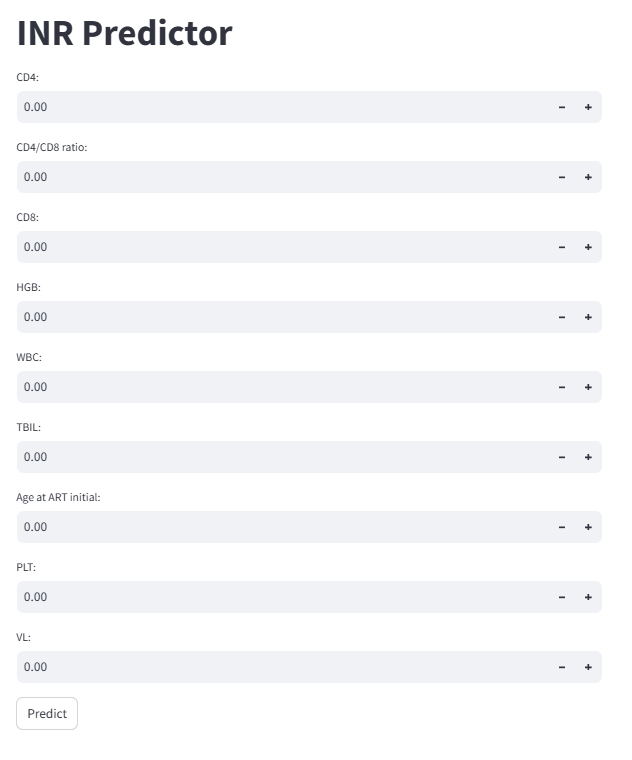

# Predicting Immune Non-Response in ART-naive People Living with HIV

## Overview
This project is a multicenter retrospective cohort study that uses machine learning to predict immune non-response in ART-naive people living with HIV. The goal is to identify factors that contribute to immune non-response and provide insights for personalized treatment strategies.

## Link
- **View Project**: [[Live Demo](https://xltx-gby.streamlit.app/)](https://xltx-gby.streamlit.app/)
- **Screenshot**:
  

